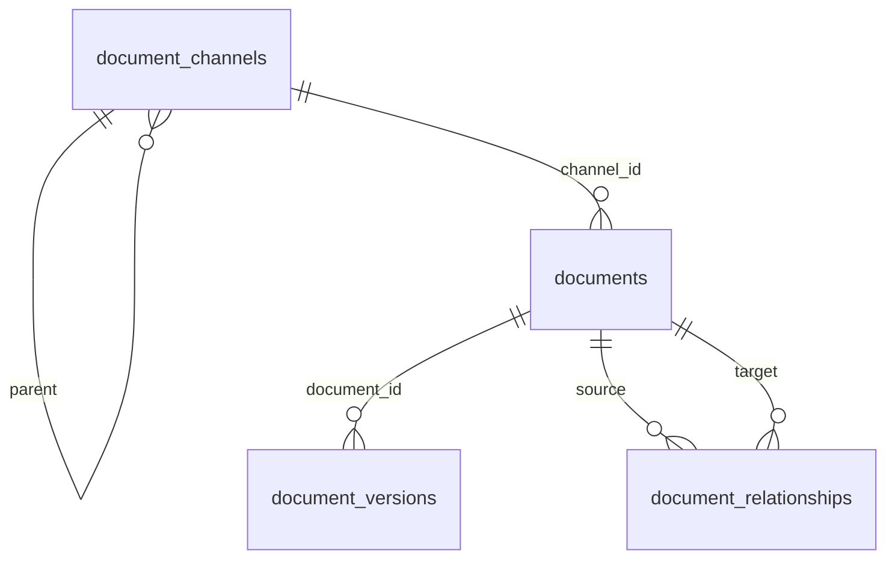

# Document lifecycle basics

Scope: **document record maintenance** — channels, upload/storage, processing **status** (not how parsing runs), policy **lifecycle**, relationships, versions, metadata, markdown working copy, and parse-result export/import.

**Out of scope here:** pipeline definitions, `openkms-cli`, VLM/PaddleOCR jobs, channel `auto_process`, and `POST /api/jobs`. See [documents.md](documents.md) for parsing pipeline details.

---

## Two lifecycle dimensions

| Dimension | Field(s) | Purpose |
|-----------|----------|---------|
| **Processing status** | `documents.status` | Upload → parse job progress: `uploaded` → `pending` → `running` → `completed` / `failed` |
| **Policy lifecycle** | `series_id`, `lifecycle_status`, `effective_from`, `effective_to` | Which revision is “current” for knowledge use; lineage grouping |

**Applicability (`is_current_for_rag`)** is computed on read (not stored). Rules in `document_lifecycle.py`:

- `lifecycle_status` **null** → applicable (legacy rows).
- `draft`, `superseded`, `withdrawn` → not applicable.
- `in_force` → applicable only when `effective_from` ≤ now ≤ `effective_to` (null bounds = open-ended).
- List filter `applicable=true|false` uses the same SQL predicate as KB indexing defaults.

**Relation types** (`document_relationships.relation_type`): `supersedes`, `amends`, `implements`, `see_also` (directed: source → target).

---

## Feature list

### Channels (folder tree)

| Feature | UI route | Notes |
|---------|----------|-------|
| Documents overview | `/documents` | Stats, quick links |
| Channel tree | `/documents/channels` | Create, rename, move, reorder, merge, delete |
| Channel document list | `/documents/channels/:channelId` | Pagination, status/applicable filters, bulk move/delete/reset-status |
| Channel settings (general) | `/documents/channels/:channelId/settings` | Name, description, parent; processing/metadata tabs exist but are pipeline-related |

Channel ACL: visibility and write follow **document channel** resource ACL (`RT_DOCUMENT_CHANNEL`). Documents inherit channel scope (no per-document sharing).

### Upload & storage

| Feature | Notes |
|---------|-------|
| Single upload | `POST /api/documents/upload` — multipart `file` + `channel_id` |
| Chunked upload | `POST /api/documents/upload-chunk` — large files (>10 MB on SPA) |
| Original file | S3 `documents/{file_hash}/original.{ext}` (legacy `{file_hash}/` still read) |
| Delete document | DB row + all objects under document prefix |
| File access | Presigned redirect / `url_only` JSON for parsing artifacts |

Accepted upload types (SPA): PDF, images, DOCX, PPTX, XLSX, EPUB, XMind. **XLSX / XMind** get in-process preview at upload (`completed` or `failed`); other types stay `uploaded` until processed (pipeline — out of scope here).

### Processing status (maintenance only)

| Feature | Notes |
|---------|-------|
| Status badge | `uploaded` / `pending` / `running` / `completed` / `failed` on list and detail |
| Reset status | `POST …/reset-status` → `uploaded` when no active procrastinate jobs; for re-processing |
| Bulk reset | Channel list multi-select |

### Document detail & content

| Feature | UI route | Notes |
|---------|----------|-------|
| Detail view | `/documents/view/:id` | Markdown, metadata, lifecycle panel, versions |
| Edit name / move channel | Detail + list modals | `PUT /api/documents/{id}` |
| Markdown working copy | Detail | View/edit toggle; `PUT …/markdown` |
| Restore markdown from storage | Detail | `POST …/restore-markdown` from `markdown.md` on S3 |
| Page index | Detail (hidden for XLSX) | Tree from headings; `GET …/page-index`, `POST …/rebuild-page-index` |
| Section extract | API / agent | `GET …/section?start_line=&end_line=` (1-based, max 500 lines) |
| Parsing result view | Detail | `GET …/parsing` (`parsing_result` JSONB) |
| Export / import parse bundle | Detail | Zip all S3 parse files; restore state to `completed` |
| Print | Detail read mode | Browser print layout |

### Explicit versions (`document_versions`)

User-triggered checkpoints of **markdown + metadata** (not created on every save).

| Feature | Notes |
|---------|-------|
| Commit version | `POST …/versions` (optional `tag`, `note`) |
| List / preview | `GET …/versions`, `GET …/versions/{id}` |
| Restore | `POST …/versions/{id}/restore`; optional `save_current_as_version` before restore |

### Metadata

| Feature | Notes |
|---------|-------|
| Unified JSONB | `documents.metadata` — extracted + manual labels |
| Manual edit | `PUT …/metadata` partial merge |
| LLM extract (on demand) | `POST …/extract-metadata` uses channel extraction model + schema |
| Channel manual labels | `label_config` on channel (object_type pickers in UI) |

### Policy lifecycle & lineage

| Feature | Notes |
|---------|-------|
| Series | `series_id` — logical policy line; defaults to document `id` on create |
| Lifecycle status | `draft` / `in_force` / `superseded` / `withdrawn` |
| Validity window | `effective_from`, `effective_to` (timestamptz) |
| Update lifecycle | `PATCH …/lifecycle` |
| Relationships | List/create/delete directed edges between documents |
| Applicable indicator | Read-only `is_current_for_rag` on API responses |

### Comments (cross-resource)

Documents support threaded comments via shared **ContentComment** API (`resource_type=document`). Not document-specific routes.

---

## API list

Base path: `/api`. All routes below require authentication unless noted.

### Document channels — `/api/document-channels`

| Method | Path | Description |
|--------|------|-------------|
| GET | `/document-channels` | Tree list; query `limit`, `offset` (paginate roots, full subtrees) |
| GET | `/document-channels/{id}` | Single channel |
| POST | `/document-channels` | Create (`name`, optional `description`, `parent_id`) |
| PUT | `/document-channels/{id}` | Update name, description, parent, sort_order, extraction/label fields |
| POST | `/document-channels/{id}/reorder` | Body `{ direction: "up" \| "down" }` among siblings |
| POST | `/document-channels/merge` | Merge source → target; move documents; delete source |
| DELETE | `/document-channels/{id}` | Fails if documents or sub-channels exist |

### Documents — `/api/documents`

| Method | Path | Description |
|--------|------|-------------|
| GET | `/documents/stats` | `{ total }` for index |
| GET | `/documents` | List; query `channel_id`, `search`, `status`, `applicable`, `offset`, `limit` |
| POST | `/documents/upload` | Multipart `file`, `channel_id` |
| POST | `/documents/upload-chunk` | Chunked upload; fields `file_chunk`, `chunk_index`, `total_chunks`, `channel_id`, `filename` |
| GET | `/documents/{id}` | Full document |
| PUT | `/documents/{id}` | Update `name`, `channel_id` |
| DELETE | `/documents/{id}` | Delete document + storage |
| POST | `/documents/{id}/reset-status` | Reset processing status to `uploaded` |

#### Content & parsing artifacts

| Method | Path | Description |
|--------|------|-------------|
| GET | `/documents/{id}/parsing` | `parsing_result` as `result.json` shape |
| PUT | `/documents/{id}/markdown` | Body `{ markdown }`; rebuilds page index on S3 |
| POST | `/documents/{id}/restore-markdown` | Restore from S3 `markdown.md` |
| POST | `/documents/{id}/rebuild-page-index` | Rebuild `page_index.json` from current markdown |
| GET | `/documents/{id}/page-index` | PageIndex tree from S3 |
| GET | `/documents/{id}/section` | Query `start_line`, `end_line` (1-based inclusive) |
| GET | `/documents/{id}/files/{file_hash}/{path}` | 302 to presigned URL; `?url_only=true` → `{ url }` |
| GET | `/documents/{id}/export` | Zip of all stored parse files |
| POST | `/documents/{id}/import` | Multipart `archive` — restore zip bundle |
| POST | `/documents/{id}/import-chunk` | Chunked import; `archive`, `chunk_index`, `total_chunks` |

#### Metadata

| Method | Path | Description |
|--------|------|-------------|
| PUT | `/documents/{id}/metadata` | Body `{ metadata }` — partial merge into JSONB |
| POST | `/documents/{id}/extract-metadata` | LLM extraction via channel config |

#### Policy lifecycle

| Method | Path | Description |
|--------|------|-------------|
| PATCH | `/documents/{id}/lifecycle` | Body: `series_id`, `effective_from`, `effective_to`, `lifecycle_status` (partial) |
| GET | `/documents/{id}/relationships` | `{ outgoing[], incoming[] }` |
| POST | `/documents/{id}/relationships` | Body: `target_document_id`, `relation_type`, optional `note` |
| DELETE | `/documents/{id}/relationships/{relationship_id}` | Delete outgoing edge only |

#### Explicit versions

| Method | Path | Description |
|--------|------|-------------|
| POST | `/documents/{id}/versions` | Snapshot; body optional `tag`, `note` |
| GET | `/documents/{id}/versions` | List (no full markdown) |
| GET | `/documents/{id}/versions/{version_id}` | Full snapshot |
| POST | `/documents/{id}/versions/{version_id}/restore` | Body: `save_current_as_version`, `tag`, `note` |

### Related (not under `/documents`)

| Method | Path | Description |
|--------|------|-------------|
| GET/POST/… | `/api/comments` | `resource_type=document`, `resource_id={document_id}` |
| GET | `/api/search` | Unified search includes `documents` type |

### Internal service routes (workers only)

Under `/internal-api/documents` — **internal client auth**; bypass channel ACL for pipeline sync. Listed for completeness; not part of user-facing lifecycle UI.

| Method | Path | Description |
|--------|------|-------------|
| GET | `/internal-api/documents/{id}` | Read document |
| GET | `/internal-api/documents/{id}/metadata-needs-extraction` | Pipeline helper |
| PUT | `/internal-api/documents/{id}/markdown` | Sync markdown |
| PUT | `/internal-api/documents/{id}/metadata` | Merge metadata |
| POST | `/internal-api/documents/{id}/versions` | Post-pipeline snapshot |

---

## Database schema

### `document_channels`

| Column | Type | Notes |
|--------|------|-------|
| `id` | VARCHAR(64) PK | e.g. `dc_xxxxxxxx` |
| `name` | VARCHAR(256) | |
| `description` | VARCHAR(1024) nullable | |
| `parent_id` | VARCHAR(64) FK → `document_channels.id` ON DELETE CASCADE nullable | Tree parent |
| `sort_order` | INTEGER | Sibling order |
| `pipeline_id` | VARCHAR(64) FK → `pipelines.id` SET NULL nullable | Pipeline link (out of scope) |
| `auto_process` | BOOLEAN default false | Auto-enqueue on upload (out of scope) |
| `extraction_model_id` | VARCHAR(64) FK → `api_models.id` SET NULL nullable | Metadata LLM |
| `extraction_schema` | JSON nullable | Schema for extraction (key order preserved) |
| `label_config` | JSON nullable | Manual label field defs |
| `object_type_extraction_max_instances` | INTEGER nullable default 100 | Extraction cap |
| `created_by` | VARCHAR(512) nullable | Creator subject |
| `created_by_name` | VARCHAR(256) nullable | |
| `created_at` | TIMESTAMPTZ | |

Indexes: `parent_id`, `created_by`.

### `documents`

| Column | Type | Notes |
|--------|------|-------|
| `id` | VARCHAR(64) PK | UUID on create |
| `name` | VARCHAR(512) | Display / original filename |
| `file_type` | VARCHAR(32) | e.g. `PDF`, `XLSX` |
| `size_bytes` | INTEGER default 0 | |
| `channel_id` | VARCHAR(64) indexed | FK logical (channel row) |
| `file_hash` | VARCHAR(128) nullable indexed | SHA-256 of original bytes; S3 key root |
| `status` | VARCHAR(32) default `uploaded` | Processing status enum |
| `markdown` | TEXT nullable | Working copy |
| `parsing_result` | JSONB nullable | Preview / parse summary for UI |
| `metadata` | JSONB nullable | Unified extracted + manual metadata |
| `series_id` | VARCHAR(64) indexed | Policy line; defaults to `id` |
| `effective_from` | TIMESTAMPTZ nullable | Validity start |
| `effective_to` | TIMESTAMPTZ nullable | Validity end |
| `lifecycle_status` | VARCHAR(32) nullable indexed | `draft` / `in_force` / `superseded` / `withdrawn` |
| `created_at` | TIMESTAMPTZ | |
| `updated_at` | TIMESTAMPTZ | |

**Computed on API read (not a column):** `is_current_for_rag`.

**Processing status values:** `uploaded`, `pending`, `running`, `completed`, `failed`.

### `document_relationships`

| Column | Type | Notes |
|--------|------|-------|
| `id` | VARCHAR(64) PK | |
| `source_document_id` | VARCHAR(64) FK → `documents.id` ON DELETE CASCADE indexed | Edge source |
| `target_document_id` | VARCHAR(64) FK → `documents.id` ON DELETE CASCADE indexed | Edge target |
| `relation_type` | VARCHAR(32) indexed | See relation types above |
| `note` | TEXT nullable | |
| `created_at` | TIMESTAMPTZ | |

**Unique:** `(source_document_id, target_document_id, relation_type)`.

### `document_versions`

| Column | Type | Notes |
|--------|------|-------|
| `id` | VARCHAR(64) PK | |
| `document_id` | VARCHAR(64) FK → `documents.id` ON DELETE CASCADE indexed | |
| `version_number` | INTEGER | Sequential per document |
| `tag` | VARCHAR(512) nullable | User label |
| `note` | TEXT nullable | |
| `markdown` | TEXT nullable | Snapshot |
| `metadata` | JSONB nullable | Snapshot (`version_metadata` in ORM) |
| `created_at` | TIMESTAMPTZ | |
| `created_by_sub` | VARCHAR(128) nullable | |
| `created_by_name` | VARCHAR(256) nullable | |

### Related tables (lifecycle consumers, not document CRUD)

| Table | Role |
|-------|------|
| `kb_documents` | Links documents to knowledge bases |
| `chunks` | Optional `document_id`; filtered by lifecycle for default KB search |
| `faqs` | Optional `document_id` |
| `content_comments` | Polymorphic `resource_type=document` |

---

## Object storage layout

When `OPENKMS_*` storage is configured, content-addressed keys under **`documents/{file_hash}/`**:

| Path | Role |
|------|------|
| `original.{ext}` | Uploaded file |
| `markdown.md` | Parse output markdown (restore source) |
| `result.json` | Full parse result |
| `page_index.json` | Heading tree for navigation |
| `extracted_metadata.json` | Pipeline extraction artifact (optional) |
| `layout_det_*`, `block_*`, `markdown_out/*` | Layout / image artifacts |

Legacy prefix `{file_hash}/` is still resolved on read. Delete uses both prefixes.

---

## Entity relationship (core tables)

---

## Code references

| Area | Path |
|------|------|
| Models | `backend/app/models/document.py`, `document_channel.py`, `document_version.py`, `document_relationship.py` |
| Public API | `backend/app/api/documents.py`, `backend/app/api/channels.py` |
| Lifecycle rules | `backend/app/services/documents/document_lifecycle.py` |
| ACL | `backend/app/services/documents/document_scope.py` |
| Schemas | `backend/app/schemas/document.py`, `backend/app/constants.py` |
| Frontend | `frontend/src/pages/documents/`, `frontend/src/data/documentsApi.ts` |
