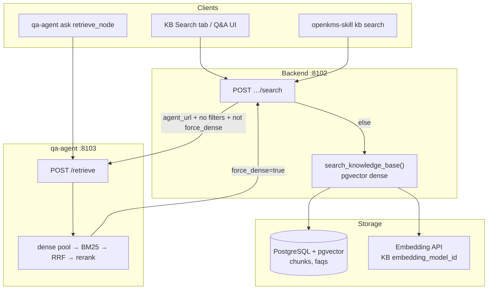
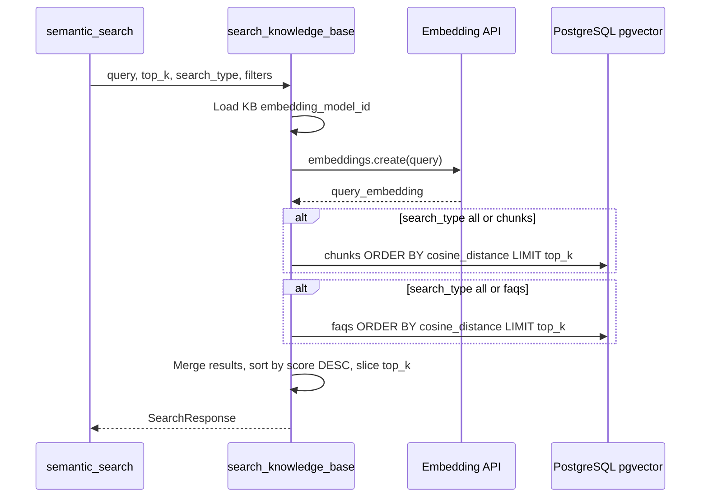
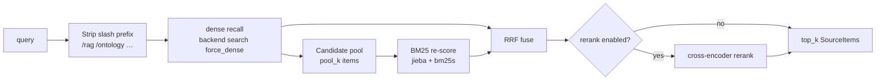

# Knowledge base retrieval (search & hybrid retrieve)

> **2026 update:** Cross-KB hybrid search lives at **`POST /api/hybrid-search`** (UI: Hybrid Search). Agent skill pack: [`openkms-skill/hybrid-search`](../openkms-skill/hybrid-search/) — auth via personal **API key** (`okf_…`), not JWT login scripts.

Technical reference for **`POST /api/knowledge-bases/{id}/search`** (per-KB product API) and **`POST {qa-agent}/retrieve`** (legacy qa-agent hybrid pipeline). For product overview and UI surfaces, see [Knowledge bases](knowledge-bases.md).

---

## openkms-skill (agents)

| Item | Location |
|------|----------|
| Skill package | [`openkms-skill/`](../openkms-skill/) |
| Scripts | `list_knowledge_bases.mjs`, `hybrid_search.mjs` (Node 18+) |
| Auth | `OPENKMS_API_URL` + `OPENKMS_API_KEY` (Settings → API keys) |
| Playground | Same key → Settings → **Playground agent API key** (`localStorage`) |

Verify: `cd agent-backend && npm run verify:user-api-key`

---

## Terminology

| Term | Layer | What it does |
|------|-------|----------------|
| **search** | Backend public API | Returns ranked **chunks** and/or **FAQs** for a query. May proxy to qa-agent for hybrid recall. |
| **retrieve** | qa-agent internal API | Runs **dense → BM25 → RRF → (optional) rerank** without LLM answer generation. Not exposed by [openkms-skill](opencode-openkms-skill.md). |
| **ask** | qa-agent (+ backend proxy) | **retrieve** + LLM answer + optional tools (Page Index, ontology). Out of scope here except where it reuses `retrieve()`. |

Do not confuse with **`GET /api/search`** — that is a **global name search** (`ILIKE` on titles), not KB semantic retrieval.

---

## Architecture overview



**Design split today**

- **Backend** owns data, permissions, query embedding, and **dense** vector search.
- **qa-agent** owns **hybrid orchestration** (BM25, RRF, rerank) and shares the same `retrieve()` path as KB **ask**.
- Hybrid is **optional**: without `agent_url` on the KB, search is dense-only in the backend.

---

## `POST …/search` — routing

**Route:** `backend/app/api/knowledge_bases_search.py` → `semantic_search()`

### Request body (`SearchRequest`)

| Field | Default | Description |
|-------|---------|-------------|
| `query` | (required) | Natural-language query |
| `top_k` | `10` | Max results returned |
| `search_type` | `"all"` | `"all"` \| `"chunks"` \| `"faqs"` |
| `label_filters` | `null` | Metadata key filters (scalar or array containment) |
| `metadata_filters` | `null` | JSONB `@>` containment on `doc_metadata` |
| `include_historical_documents` | `false` | When false, excludes chunks/FAQs tied to non-current lifecycle documents |
| `force_dense` | `false` | Skip hybrid; backend dense only. **qa-agent sets this** when calling back to avoid recursion |

### Hybrid vs dense-only decision

Hybrid (`qa-agent /retrieve`) is used **only when all** of the following hold:

1. KB has **`agent_url`** configured
2. **`force_dense`** is false
3. **No filters** — i.e. all of:
   - `label_filters` empty
   - `metadata_filters` empty
   - `include_historical_documents` is false
   - `search_type` is `"all"` (default)

Otherwise the backend calls `search_knowledge_base(..., retrieval_mode="dense_fallback")` directly.

If hybrid proxy fails (network, 5xx), the backend **logs a warning** and falls back to dense-only.

```text
has_filters = label_filters OR metadata_filters OR include_historical OR search_type != "all"

if agent_url AND NOT has_filters AND NOT force_dense:
    POST {agent_url}/retrieve
else:
    search_knowledge_base(dense)
```

### Response (`SearchResponse`)

| Field | Description |
|-------|-------------|
| `query` | Echo of input query |
| `results[]` | `SearchResult` items (see below) |

Each **`SearchResult`** may include operator/debug fields:

| Field | Description |
|-------|-------------|
| `id` | Chunk or FAQ row id |
| `source_type` | `"chunk"` or `"faq"` |
| `content` | Chunk text; FAQ formatted as `Q: …\nA: …` |
| `score` | Final relevance score (meaning depends on `retrieval_mode`) |
| `source_name` | Document or wiki page title (chunks) |
| `document_id`, `wiki_page_id`, `wiki_space_id` | Provenance |
| `doc_metadata` | Snapshot metadata from indexing |
| `chunk_index` | Ordinal within source (chunks only) |
| `retrieval_mode` | See [Retrieval modes](#retrieval-modes) |
| `retrieval_debug` | Stage ranks/scores for debugging |

---

## Dense retrieval (`search_knowledge_base`)

**Implementation:** `backend/app/services/knowledge_bases/kb_search.py`

### Pipeline



### Steps

1. **Validate KB** — 404 if missing; 400 if no `embedding_model_id`.
2. **Embed query** — OpenAI-compatible API from the KB’s configured embedding model (`ApiModel` + provider).
3. **Build WHERE clauses** — KB id, non-null embedding, optional label/metadata filters, optional lifecycle filter (`source_current_for_rag_sql`).
4. **Chunk query** (if `search_type` is `"all"` or `"chunks"`):
   - `cosine_distance(query_embedding)` on `chunks.embedding`
   - Join `documents` / `wiki_pages` for `source_name`
   - `score = 1.0 - distance`
5. **FAQ query** (if `search_type` is `"all"` or `"faqs"`):
   - Same distance on `faqs.embedding` (**question text only** was embedded at index time)
   - `content` = `Q: {question}\nA: {answer}`
6. **Merge** — Concatenate chunk + FAQ hits, sort by `score` descending, return first `top_k`.

### Embedding coupling

Dense retrieval is **hard-bound** to the KB’s `embedding_model_id`:

- Index job (`kb-index`) and online search must use the **same model** (and compatible dimensions) as stored vectors.
- Changing the embedding model requires a **full re-index**.

BM25, RRF, and rerank do **not** use the embedding model.

### Errors

- Missing pgvector extension → **503** with install instructions.
- No ANN index today — full-table `cosine_distance` scan (see [tech debt](../tech_debt.md)).

---

## Hybrid retrieval (`POST /retrieve`)

**Implementation:** `qa-agent/qa_agent/retriever.py` → `retrieve()`

**Endpoint:** `qa-agent/qa_agent/main.py` → `retrieve_endpoint()`  
**Not** a public backend route. Invoked by:

- Backend `semantic_search()` when hybrid routing applies
- qa-agent `retrieve_node` during **ask** (default `top_k=5`)

### Request (`RetrieveRequest`)

| Field | Default |
|-------|---------|
| `knowledge_base_id` | (required) |
| `query` | (required) |
| `access_token` | `""` — forwarded as `Authorization: Bearer` to backend dense recall |
| `top_k` | `5` |

### End-to-end pipeline



### Stage 0 — Query normalization

Leading slash commands are stripped once: `/rag`, `/ontology`, `/page-index`, `/premium`, `/calculator`, `/compare`. This does **not** switch retrieval mode; it only removes the prefix before search.

### Stage 1 — Dense recall (candidate pool)

- **HTTP:** `POST {OPENKMS_BACKEND_URL}/api/knowledge-bases/{id}/search`
- **Body:** `{ query, top_k: pool_k, search_type: "all", force_dense: true }`
- **Auth:** User’s bearer token from `access_token`

**Pool size:**

```text
pool_k = max(2 × top_k, OPENKMS_RERANK_RECALL_TOP_K)   # default rerank_recall_top_k = 25
```

Chunks and FAQs are merged by the backend dense path (each source type contributes up to `pool_k` before global merge — see dense merge behavior).

### Stage 2 — BM25 re-score (candidate pool only)

**Implementation:** `qa-agent/qa_agent/bm25_index.py`

- Builds a **temporary** BM25 index over the dense pool’s `content` strings (not the full KB corpus).
- Tokenization: **jieba** (`cut_all=False`), lowercased tokens.
- Returns up to `recall_k = max(top_k, OPENKMS_HYBRID_RECALL_TOP_K)` hits (default hybrid recall **50**).
- Disabled when `OPENKMS_BM25_ENABLED=false` or on failure → empty BM25 list → dense-only path.

**Implication:** BM25 cannot surface documents that dense recall missed.

### Stage 3 — RRF (Reciprocal Rank Fusion)

When **both** dense and BM25 lists are non-empty:

```text
retrieval_mode = "hybrid"
fused_top_n = max(top_k, OPENKMS_RERANK_RECALL_TOP_K)

For each ranked list (dense, bm25):
  for rank r (0-based) of candidate id:
    rrf_score[id] += 1 / (OPENKMS_RRF_K + r + 1)    # default RRF_K = 60

Sort by rrf_score DESC, take fused_top_n
```

`score` on each result is replaced with the RRF score. Per-stage ranks are copied into `retrieval_debug` (`dense_rank`, `bm25_rank`, `rrf_score`, etc.).

**Degradation:**

| dense | BM25 | Mode | Candidates |
|-------|------|------|--------------|
| ✓ | ✓ | `hybrid` | RRF fused |
| ✓ | ✗ | `dense` | dense list |
| ✗ | ✓ | `bm25_only` | BM25 list (rare) |
| ✗ | ✗ | — | empty |

### Stage 4 — Rerank (optional cross-encoder)

**Default: off** (`OPENKMS_RERANK_ENABLED=false`).

When enabled and `len(candidates) > top_k`:

- **HTTP:** `POST {base}/rerank` (OpenAI-compatible; base from `OPENKMS_RERANK_BASE_URL` or LLM defaults)
- **Model:** `OPENKMS_RERANK_MODEL_NAME` (default `BAAI/bge-reranker-v2-m3`)
- Reorders candidates; `score` becomes `relevance_score` from the rerank API
- On failure → keep RRF (or dense) order, truncate to `top_k`

### Anti-recursion contract

```text
Client → backend /search (force_dense=false)
           → qa-agent /retrieve
               → backend /search (force_dense=true)  → dense only
```

Without `force_dense`, hybrid would call itself indefinitely.

---

## Retrieval modes

| `retrieval_mode` | When set | `retrieval_debug.pipeline_stages` (typical) |
|------------------|----------|-----------------------------------------------|
| `hybrid` | Dense + BM25 fused via RRF | `["dense", "bm25", "rrf"]` (+ `"rerank"` if applied) |
| `dense` | Dense only (no BM25 or BM25 failed) | `["dense"]` |
| `bm25_only` | Dense failed, BM25 has hits | `["bm25"]` |
| `dense_fallback` | Backend path: filters, `force_dense`, no `agent_url`, or hybrid proxy failure | `["dense"]` |

Final `score` field:

- **dense / dense_fallback:** cosine similarity `1 - distance`
- **hybrid (post-RRF):** RRF score (until rerank overwrites it)
- **after rerank:** cross-encoder relevance score

---

## Configuration

### Knowledge base (database / Settings UI)

| Field | Role in retrieval |
|-------|-------------------|
| `embedding_model_id` | Required for dense; query + index embeddings |
| `agent_url` | Enables hybrid path for unfiltered `search`; required for `ask` |
| `chunk_config` | Affects chunk boundaries at index time only |
| `metadata_keys` | Propagates document metadata into chunks/FAQs for filtering |

### qa-agent environment (`qa-agent/.env`)

| Variable | Default | Purpose |
|----------|---------|---------|
| `OPENKMS_BACKEND_URL` | `http://localhost:8102` | Dense recall callback |
| `OPENKMS_BM25_ENABLED` | `true` | BM25 stage |
| `OPENKMS_RRF_K` | `60` | RRF constant *k* |
| `OPENKMS_HYBRID_RECALL_TOP_K` | `50` | BM25 output cap |
| `OPENKMS_RERANK_RECALL_TOP_K` | `25` | Dense pool floor; RRF output cap before rerank |
| `OPENKMS_RERANK_ENABLED` | `false` | Cross-encoder rerank |
| `OPENKMS_RERANK_BASE_URL` | (LLM base) | `/v1/rerank` host |
| `OPENKMS_RERANK_MODEL_NAME` | `BAAI/bge-reranker-v2-m3` | Rerank model id |

### Infrastructure

- **pgvector** extension required in PostgreSQL.
- Embedding provider must be reachable from **backend** (not qa-agent) for dense search.

---

## Client integration

| Client | Command / UI | API | Hybrid? |
|--------|--------------|-----|---------|
| SPA | KB detail → Search tab | `POST …/search` | When KB has `agent_url` and options are default |
| openkms-skill | `kb search --id KB --q "…"` | Same | Same (only passes `query`, `top_k`) |
| qa-agent ask | `retrieve_node` | Internal `retrieve()` | Always (if dense recall succeeds) |
| Evaluation | `search_retrieval` runs | `POST …/search` | Same rules as SPA |

**openkms-skill** does not expose `search_type`, filters, or `force_dense` — extend the CLI in the repo if agents need them.

---

## Known limitations

1. **Hybrid ignores filters** — Any `search_type` ≠ `all`, metadata/label filters, or `include_historical_documents` forces dense-only in the backend.
2. **BM25 is pool-local** — No full-corpus lexical recall; product codes help only if dense already surfaced a related chunk.
3. **FAQ vectors use question text only** — Answer body is not embedded.
4. **No vector ANN index** — Large KBs pay full scan cost on dense.
5. **Circular hop** — Hybrid adds latency: backend → qa-agent → backend → qa-agent.
6. **Page Index** is not part of search/retrieve — document section navigation is a **qa-agent tool** during ask only.

---

## Source files

| Component | Path |
|-----------|------|
| Search API route | `backend/app/api/knowledge_bases_search.py` |
| Dense search service | `backend/app/services/knowledge_bases/kb_search.py` |
| Request/response schemas | `backend/app/schemas/knowledge_base.py` |
| Lifecycle filter | `backend/app/services/documents/document_lifecycle.py` |
| Hybrid retriever | `qa-agent/qa_agent/retriever.py` |
| BM25 scoring | `qa-agent/qa_agent/bm25_index.py` |
| qa-agent `/retrieve` route | `qa-agent/qa_agent/main.py` |
| qa-agent settings | `qa-agent/qa_agent/config.py` |
| KB search UI | `frontend/src/pages/knowledge-bases/useKnowledgeBaseDetail.ts` |
| skill `kb search` | `openkms-skill/scripts/openkms/commands/kb.py` |

---

## Related

- [Knowledge bases](knowledge-bases.md) — product features, indexing, Q&A UI
- [API reference — KB search](api-reference.md) — route table
- [QA agent service](../architecture.md#qa-agent-service) — deployment and ask integration
- [openkms-skill](opencode-openkms-skill.md) — agent CLI over backend APIs
