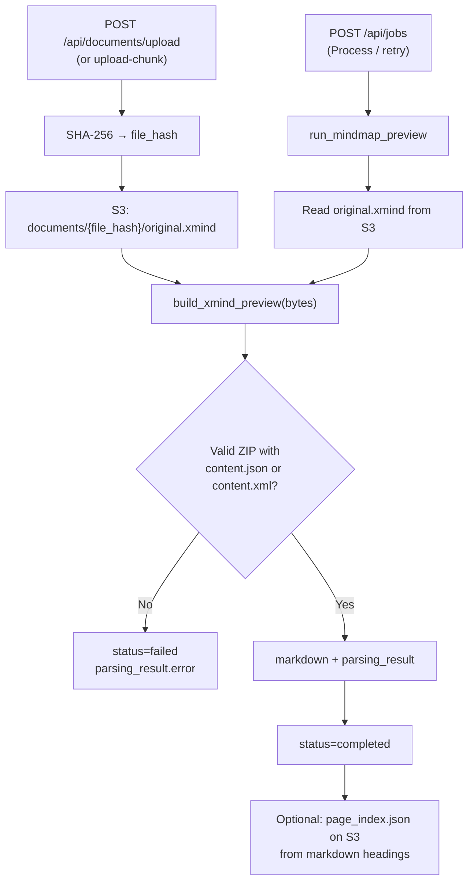

x# XMind processing

How openKMS handles `.xmind` uploads: **no VLM pipeline**, **no `openkms-cli` parse**. The backend treats an XMind file as a ZIP archive, reads its topic tree, and **converts it to outline Markdown** for display, search, and knowledge-base indexing.

Related: [documents.md](documents.md) (upload & processing overview), [document-lifecycle-basics.md](document-lifecycle-basics.md) (upload/storage), [pipelines-and-jobs.md](pipelines-and-jobs.md) (`run_pipeline` — not used for XMind).

---

## Can XMind be interpreted as Markdown?

**Partially yes — for knowledge use, not as a visual substitute.**

| Aspect | Interpretation |
|--------|----------------|
| **Semantic structure** | Sheet title → `#`, root topic → `##`, child topics → nested `-` list items. The mind map hierarchy becomes a **text outline**. |
| **Text content** | Topic titles, notes, labels, markers, and hyperlinks are mapped to Markdown (links, inline code for labels, angle brackets for markers, blockquotes for notes). |
| **Downstream** | The generated string is stored in `documents.markdown` and used like any other document markdown (page index, KB chunking, export). |
| **Not preserved** | Canvas layout, colors, fonts, topic shapes, embedded images inside topics, relationships drawn between nodes, and XMind-specific styling. Attachments are **listed by path** only — binary files are not inlined. |
| **Format** | This is **outline Markdown**, not a round-trip representation of `.xmind`. Re-exporting the markdown will not recreate the original mind map in XMind. |

So: for RAG, search, and reading in the document viewer, XMind is **normalized to Markdown**. For design or editing in XMind, keep the original `.xmind` on S3 (`original.xmind`).

---

## Position in the document pipeline

XMind is classified with XLSX as a **structured non-VLM** type (`STRUCTURED_NON_VLM_FILE_TYPES` in the SPA; same idea in the API).

| Step | XMind behavior |
|------|----------------|
| Upload | Synchronous `build_xmind_preview` → usually `status=completed` or `failed` |
| Channel `auto_process` + `pipeline_id` | **Skipped** — XMind branch runs before the auto-process branch |
| `POST /api/jobs` | Dispatches `run_mindmap_preview`, not `run_pipeline` |
| `force_reparse` | **Ignored** for `.xmind` |
| Channel metadata extraction (LLM) | **Not** run on the XMind upload/re-preview path |
| S3 `result.json` | **Not** written by XMind processing (unlike VLM parses) |

---

## End-to-end flow



### Upload path (primary)

1. API reads file bytes, computes `file_hash` (content-addressed; filename does not affect hash).
2. Original stored at `documents/{file_hash}/original.xmind`.
3. `build_xmind_preview` runs in a thread pool (`asyncio.to_thread`).
4. On success: `markdown`, `parsing_result`, `status=completed`; `_maybe_upload_page_index_from_markdown` may write `page_index.json`.
5. On failure: `status=failed`, `parsing_result` with `document_kind: mindmap` and an error message.

**Code:** `backend/app/api/documents.py` (`upload_document`, `upload_document_chunk`).

### Re-process path

When the user clicks **Process** (uploaded/failed) or retries a job:

1. `POST /api/jobs` with `document_id` only (no `pipeline_id` required).
2. Worker task `run_mindmap_preview`: `status` → `running` → read S3 original → `build_xmind_preview` → update DB → `completed` or `failed`.

**Code:** `backend/app/api/jobs.py`, `backend/app/jobs/tasks.py` (`run_mindmap_preview`).

---

## `build_xmind_preview` details

**Module:** `backend/app/services/documents/mindmap_preview.py`

### Input

- Raw bytes of the `.xmind` file (ZIP archive).

### Archive format detection

1. Open as `zipfile.ZipFile`.
2. If `content.json` exists → **JSON format** (XMind 8+ / Zen).
3. Else if `content.xml` exists → **XML format** (legacy).
4. Else → `MindmapPreviewError`: no readable content.

### JSON path (`content.json`)

- Accepts: top-level `{ "sheets": [...] }`, a single sheet `{ "rootTopic": ... }`, or a list of sheets.
- Walks each sheet’s `rootTopic` and attached/detached children.
- Per topic: `title`, `notes.plain.content`, `labels`, `markers` / `marker-refs`, `hyperlink` / `href`.

### XML path (`content.xml`)

- Parses sheets → `topic` elements.
- Per topic: `title`, `notes/plain`, `labels/label`, `markers/marker`, xlink `href`.

### Markdown generation

For each sheet:

```markdown
# {sheet title}
## {root topic title}
> {root note lines as blockquote}

- {child topic} `label` <marker-id>
  > {child note}
  - {grandchild}
  ...
```

- **Indentation:** two spaces per tree level (not nested heading levels for every node).
- **Escaping:** Markdown-special characters in titles are backslash-escaped.
- **Hyperlinks:** `[title](url)`.
- **Labels:** wrapped in backticks.
- **Markers:** wrapped in `<...>`.
- **Notes:** blockquote lines under the topic line.

If the ZIP contains other files (excluding `content.json`, `content.xml`, `metadata.json`, `manifest.json`, `meta.xml`, `styles.xml`, `Thumbnails/`), an **Attachments** section is appended:

```markdown
## Attachments

- `attachments/note.txt` (1234 bytes)
```

### `parsing_result` JSON (stored on document row)

| Field | Meaning |
|-------|---------|
| `document_kind` | Always `"mindmap"` |
| `file_hash` | SHA-256 of original bytes |
| `format` | `"content.json"` or `"content.xml"` |
| `page_count` | Number of sheets |
| `sheets` | `[{ name, root_title, topic_count }, ...]` |
| `attachments` | `[{ path, size_bytes }, ...]` |

### Output artifacts

| Location | Content |
|----------|---------|
| `documents.markdown` | Full outline markdown (all sheets + attachments section) |
| `documents.parsing_result` | Preview JSON above |
| S3 `documents/{file_hash}/original.xmind` | Original upload |
| S3 `documents/{file_hash}/page_index.json` | Optional; heading tree from markdown (upload path only; rebuild via markdown save / `POST /rebuild-page-index`) |
| S3 `result.json` | **Not** produced by XMind flow |

---

## Example (from tests)

Input (simplified `content.json`):

- Sheet **Plan**, root **Root** with note “Root note”, child **Child** with label `todo`, grandchild **Grandchild**.

Output markdown (excerpt):

```markdown
# Plan
## Root
> Root note
- Child `todo`
  - Grandchild

## Attachments

- `attachments/note.txt` (5 bytes)
```

---

## Frontend behavior

- File type `XMIND` or `parsing_result.document_kind === 'mindmap'` → mind map UI on document detail (sheet list, topic counts, attachment list).
- **Process** enabled without channel pipeline (`documentTypeRequiresPipeline` returns false for XMind).
- `force_reparse` checkbox hidden for XMind (same as XLSX).

**Code:** `frontend/src/data/channelUtils.ts`, `frontend/src/pages/documents/useDocumentDetail.tsx`, `DocumentDetail.splitPanel.tsx`.

---

## Limitations and edge cases

| Topic | Behavior |
|-------|----------|
| Corrupt or non-ZIP file | `failed` at upload |
| ZIP without `content.json` / `content.xml` | `failed` |
| Multiple sheets | Each sheet becomes a `#` section in one markdown document |
| Same bytes, different filename | Same `file_hash` and S3 object; separate `documents` rows |
| Delete one document | Deletes entire `documents/{file_hash}/` prefix — affects other rows sharing that hash |
| Visual mind map | Not rendered; only outline text |
| Topic images | Not extracted into markdown; only listed if stored as separate ZIP entries |

---

## Code references

| Area | Path |
|------|------|
| Preview builder | `backend/app/services/documents/mindmap_preview.py` |
| Upload | `backend/app/api/documents.py` |
| Job dispatch | `backend/app/api/jobs.py` |
| Worker task | `backend/app/jobs/tasks.py` (`run_mindmap_preview`) |
| Tests | `backend/tests/test_mindmap_preview.py` |
| CLI cache skip (mindmap not reused as VLM cache) | `openkms-cli/openkms_cli/pipeline_cli.py` (`_cached_parse_usable`) |
